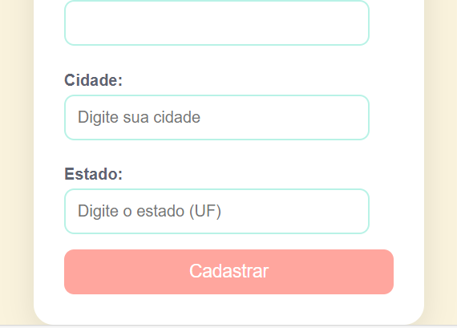

# 🌸 Bem-vindo ao Projeto: Cadastro de Endereço com consumo de API (ViaCep) 🌸

# ❤️ Resuminho
 
Este projeto consiste em um sistema de cadastro de endereço com preenchimento automático baseado no CEP. Ao digitar o CEP, os campos de cidade, rua, bairro e estado são preenchidos automaticamente, tornando o processo de cadastro mais rápido e eficiente. Essa funcionalidade visa facilitar a experiência do usuário, eliminando a necessidade de inserir essas informações manualmente.

 # 🧩 Linguagens ultilizadas

🔧 > HTML: Estruturei a página com um formulário intuitivo para cadastro de endereços.

🎨 > CSS: Usei um design minimalista com uma paleta de rosa.

💻 > JavaScript: Desenvolvi a função de preenchimento automático dos campos, incluí uma opção para limpar os dados 
inseridos e implementei uma verificação para garantir a validade do CEP.

## 💡Via Cep
 é um serviço brasileiro que permite consultar endereços a partir do CEP (Código de Endereçamento Postal). Ele fornece informações detalhadas sobre localidades, como logradouro, bairro, cidade e estado, facilitando a busca por endereços em todo o país.
 ela foi de referencia para a ultilização do nosso codigo.
 

## Novos recursos do Javascript que aprendi durante esse projeto 
- API
- addEventListener
- hasOwnProperty
- async
- await
- Focusout
- Json
- Fetch

# API 💡

> OQUE É? 🤔​

APIs de navegadores — construções presentes no navegador, as quais são baseadas em linguagem JavaScript e permitem a implementação de funcionalidades de uma maneira mais fácil.

> O que significa API❓​

 API significa Application Programming Interface (Interface de Programação de Aplicação). No contexto de APIs, a palavra Aplicação refere-se a qualquer software com uma função distinta. A interface pode ser pensada como um contrato de serviço entre duas aplicações.

 ## referencias

 - [MDN web docs](https://developer.mozilla.org/pt-BR/docs/Learn/JavaScript/Client-side_web_APIs/Introduction)

# ADDEVENTLISTENER 💻​

> OQUE É? 🤔​

 Sua é função addEventListener define o gatilho para execução do código JavaScript para receber os dados da requisição. O tipo do event listener é fetch, o qual recebe o fetchEvent.

 > POR QUE USAR addEventListener❓​

addEventListener é a maneira de registrar uma espera de evento como especificada no W3C DOM. Seus benefícios são os seguintes:

- Permite mais de um manipulador por evento. Isso é particularmente útil em bibliotecas DHTML ou em extensões Mozilla que precisam trabalhar bem mesmo com outras bibliotecas/extensões sendo usadas.

- Te dá um pente-fino do estágio em que a espera de evento é ativada (captura ou borbulha).

- Funciona em qualquer elemento DOM, não só para elementos HTML

 ## referencias 
 [Azion Runtime](https://www.azion.com/pt-br/documentacao/produtos/edge-application/edge-functions/runtime-apis/javascript/add-eventlistener/)
 [MDN web docs](https://developer.mozilla.org/pt-BR/docs/Web/API/EventTarget/addEventListener)

 # HASOWNPROPERTY 💡

> OQUE É? 🤔​ 

 hasOwnProperty é a única alternativa em JavaScript que lida com propriedades sem atravessar a cadeia de protótipos. Nota: Não é suficiente apenas verificar se o valor da propriedade é undefined para saber se ela existe. A propriedade pode muito bem existir e não ter sido inicializada, sendo assim o seu valor undefined

 > METODO ​⬇️​
 
Essa função retorna um valor booleano (true ou false) indicando se o objeto possui a propriedade especificada. Para usar o método hasOwnProperty , você precisa ter uma referência ao objeto que deseja verificar e o nome da propriedade que está verificando.

  ## referencias 
 [Awari](https://awari.com.br/javascript-hasownproperty-verificando-se-um-objeto-possui-uma-propriedade-especifica-em-javascript/)
 [MDN web docs](https://developer.mozilla.org/pt-BR/docs/Web/JavaScript/Reference/Global_Objects/Object/hasOwnProperty)

 # ASYNC 💻​

> OQUE É? 🤔​ 

 são uma sintaxe que simplifica a programação assíncrona, facilitando o fluxo de escrita e leitura do código; assim é possível escrever código que funciona de forma assíncrona, porém é lido e estruturado de forma síncrona.

> PORQUE USAR ASYNC❓​

 é uma abordagem poderosa para trabalhar com programação assíncrona em . NET. Ele traz benefícios em termos de legibilidade, responsividade e desempenho, permitindo que você escreva código assíncrono de forma mais simples e eficiente.Aug 3, 2023

 ## referencias 
 [Alura](https://www.alura.com.br/artigos/async-await-no-javascript-o-que-e-e-quando-usar?utm_term=&utm_campaign=%5BSearch%5D+%5BPerformance%5D+-+Dynamic+Search+Ads+-+Artigos+e+Conte%C3%BAdos&utm_source=adwords&utm_medium=ppc&hsa_acc=7964138385&hsa_cam=11384329873&hsa_grp=164068847699&hsa_ad=703853156311&hsa_src=g&hsa_tgt=aud-409949667484:dsa-2273097816642&hsa_kw=&hsa_mt=&hsa_net=adwords&hsa_ver=3&gad_source=1&gclid=Cj0KCQjwpP63BhDYARIsAOQkATawRP0944OQhNZQ3uuFJqfWI4JM2HLwvLBoObXaO085H9NLxV-uxssaAnD_EALw_wcB)

# AWAIT 💡

 > OQUE É? 🤔​ 

 Uma função assíncrona pode conter uma expressão await , que pausa a execução da função assíncrona e espera pela resolução da Promise passada, e depois retoma a execução da função assíncrona e retorna o valor resolvido.

>ONDE É USADO❓​

 O await é usado dentro de funções assíncronas para aguardar a resolução de uma Promise. A Promise faz com que o código pause sua execução até que seja resolvida ou rejeitada. A Promise retorna o valor resolvido quando ela é resolvida com sucesso, enquanto lança um erro quando é rejeitada.

  ## referencias
* [MDN web docs](https://developer.mozilla.org/pt-BR/docs/Web/JavaScript/Reference/Statements/async_function)
- [mestres dO wp](https://www.mestresdowp.com.br/curso-de-javascript-aula-8-async-await-e-fetch-api/)

# FETCH

 > OQUE É? 🤔​ 

A API Fetch fornece uma interface JavaScript para acessar e manipular partes do pipeline HTTP, tais como os pedidos e respostas. Ela também fornece o método global fetch() que fornece uma maneira fácil e lógica para buscar recursos de forma assíncrona através da rede.

> OQUE O FETCH FAZ ?

é uma API de busca do Javascript que permite realizar requisições HTTP assíncronas entre uma aplicação web e recursos externos. A função fetch é nativa do navegador e está disponível no ambiente de execução do Javascript em navegadores modernos.

 ## referencias

[Full Stack Week](https://www.dio.me/articles/fetch-a-funcao-mais-importante-do-javascript)
 [MDN Web Docs](https://developer.mozilla.org/pt-BR/docs/Web/API/Fetch_API/Using_Fetch)

 # JSON

 > OQUE É? 🤔​ 

 O formato JSON (JavaScript Object Notation) é, como o nome sugere, uma forma de notação de objetos JavaScript, de modo que eles possam ser representados de uma forma comum a diversas linguagens.

> OQUE O JSON FAZ?

 um formato aberto usado como alternativa ao XML para a transferência de dados estruturados entre um servidor de Web e uma aplicação Web.

  ## referencias
  [alura](https://www.alura.com.br/artigos/o-que-e-json)
  [38 Formato JSON](https://ceweb.br/guias/dados-abertos/capitulo-38/)

  # FOCUSOUT

 > OQUE É? 🤔​ 

O evento focusout é acionado assim que o elemento perde o foco. A principal diferença entre esse evento e o evento blur, é que esse ultimo não gera "borbulhas.

  ## referencias
[MDN Web Docs](https://developer.mozilla.org/pt-BR/docs/Web/API/Element/focusout_event#compatibilidade_com_navegadores)

# ❤️ veja a ilustração do meu projeto!

# 🎉 linkedin
Este projeto será documentado no LinkedIn para compartilhar meu trabalho e experiência com a comunidade.

# *📝 Autoria:*
Este projeto é uma criação ´´Luamy Alves Gama´´.

