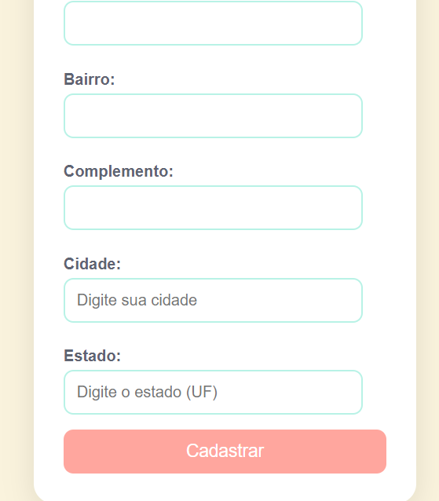
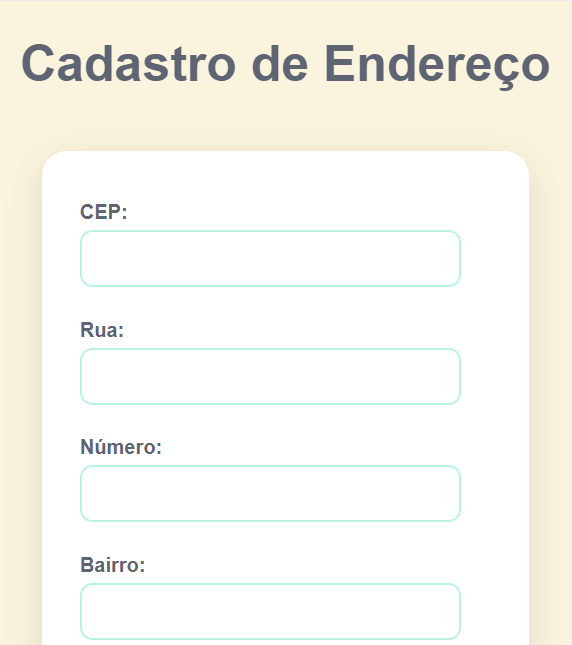

# 🌸 Bem-vindo ao Projeto: Cadastro de Endereço com consumo de API (ViaCep) 🌸

## ❤️ Resuminho
 
Este projeto consiste em um sistema de cadastro de endereço com preenchimento automático baseado no CEP. Ao digitar o CEP, os campos de cidade, rua, bairro e estado são preenchidos automaticamente, tornando o processo de cadastro mais rápido e eficiente. Essa funcionalidade visa facilitar a experiência do usuário, eliminando a necessidade de inserir essas informações manualmente.

 # 🧩 Linguagens ultilizadas

🔧 > HTML: Estruturei a página com um formulário intuitivo para cadastro de endereços.

🎨 > CSS: Usei um design minimalista com uma paleta de rosa.

💻 > JavaScript: Desenvolvi a função de preenchimento automático dos campos, incluí uma opção para limpar os dados 
inseridos e implementei uma verificação para garantir a validade do CEP.

## 💡Via Cep
 é um serviço brasileiro que permite consultar endereços a partir do CEP (Código de Endereçamento Postal). Ele fornece informações detalhadas sobre localidades, como logradouro, bairro, cidade e estado, facilitando a busca por endereços em todo o país.
 ela foi de referencia para a ultilização do nosso codigo.

## Linguagem de programação que aprendi durante esse projeto 
- API
- addEventListener
- hasOwnProperty
- async
- await

## API 💡

> OQUE É? 🤔​

APIs de navegadores — construções presentes no navegador, as quais são baseadas em linguagem JavaScript e permitem a implementação de funcionalidades de uma maneira mais fácil.

> O que significa API❓​

 API significa Application Programming Interface (Interface de Programação de Aplicação). No contexto de APIs, a palavra Aplicação refere-se a qualquer software com uma função distinta. A interface pode ser pensada como um contrato de serviço entre duas aplicações.

 ## referencias

 - MDN web docs

## ADDEVENTLISTENER 💻​

> OQUE É? 🤔​

 Sua é função addEventListener define o gatilho para execução do código JavaScript para receber os dados da requisição. O tipo do event listener é fetch, o qual recebe o fetchEvent.

 > POR QUE USAR addEventListener❓​

addEventListener é a maneira de registrar uma espera de evento como especificada no W3C DOM. Seus benefícios são os seguintes:

- Permite mais de um manipulador por evento. Isso é particularmente útil em bibliotecas DHTML ou em extensões Mozilla que precisam trabalhar bem mesmo com outras bibliotecas/extensões sendo usadas.

- Te dá um pente-fino do estágio em que a espera de evento é ativada (captura ou borbulha).

- Funciona em qualquer elemento DOM, não só para elementos HTML

 ## referencias 
 - Azion Runtime
 - MDN web docs

 ## HASOWNPROPERTY 💡

> OQUE É? 🤔​ 

 hasOwnProperty é a única alternativa em JavaScript que lida com propriedades sem atravessar a cadeia de protótipos. Nota: Não é suficiente apenas verificar se o valor da propriedade é undefined para saber se ela existe. A propriedade pode muito bem existir e não ter sido inicializada, sendo assim o seu valor undefined

 > METODO ​⬇️​
 
 hasOwnPropertyé um método em JavaScript que é usado para verificar se um objeto tem uma propriedade específica. Ele retorna truese o objeto contém a propriedade diretamente e falsese a propriedade é herdada de sua cadeia de protótipos.

  ## referencias 
- SheCodes
- MDN web docs

 ## ASYNC 💻​

> OQUE É? 🤔​ 

 são uma sintaxe que simplifica a programação assíncrona, facilitando o fluxo de escrita e leitura do código; assim é possível escrever código que funciona de forma assíncrona, porém é lido e estruturado de forma síncrona.

> PORQUE USAR ASYNC❓​

 é uma abordagem poderosa para trabalhar com programação assíncrona em . NET. Ele traz benefícios em termos de legibilidade, responsividade e desempenho, permitindo que você escreva código assíncrono de forma mais simples e eficiente.Aug 3, 2023

 ## referencias 
 - Alura
 - DIO

## AWAIT 💡

 > OQUE É? 🤔​ 

 Uma função assíncrona pode conter uma expressão await , que pausa a execução da função assíncrona e espera pela resolução da Promise passada, e depois retoma a execução da função assíncrona e retorna o valor resolvido.

>ONDE É USADO❓​

 O await é usado dentro de funções assíncronas para aguardar a resolução de uma Promise. A Promise faz com que o código pause sua execução até que seja resolvida ou rejeitada. A Promise retorna o valor resolvido quando ela é resolvida com sucesso, enquanto lança um erro quando é rejeitada.

  ## referencias
- MDN web docs
- mestres dO wp

# ❤️ veja a ilustração do meu projeto!

# 🎉 linkedin
Este projeto será documentado no LinkedIn para compartilhar meu trabalho e experiência com a comunidade.

# *📝 Autoria:*
Este projeto é uma criação ´´Luamy Alves Gama´´.

